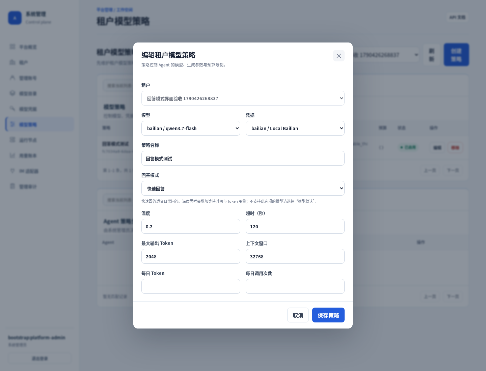
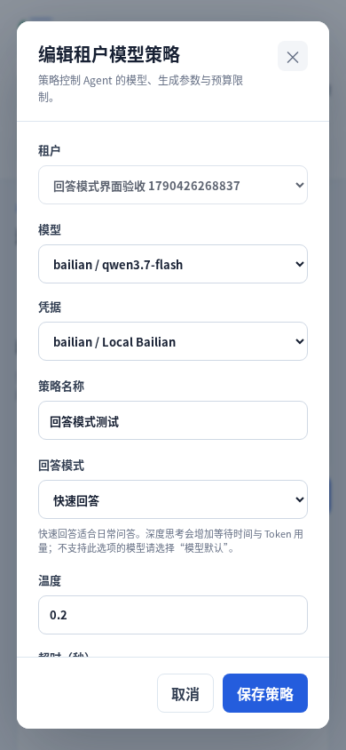

# 后续验收与运行修复（2026-09-26）

## 范围与授权

接续 `bb7f882` 的真实模型修复。用户允许修改代码、本地提交、创建和清理测试数据，并要求保留 IM 机器人 ID 和密钥；本轮使用既有企业微信绑定，不修改其凭据。基线需求见根目录 README 和 [前一轮报告](真实模型验收与修复-2026-09-25.md)。

## 修复内容

| 问题 | 修改及边界 |
| --- | --- |
| 额度、凭据或模型配置错误被 SDK 转成通用事件，Worker 重复重试 | 在 SDK 1.1.19 的模型适配边界保留结构化 HTTP 状态及错误码；400/401/403/404/422 作为永久配置错误，免费额度限制单独归类。429 和服务端错误沿用原重试机制。已识别的永久错误在交给 SDK 日志前移除供应商诊断正文，持久化安全错误码。 |
| Flash 默认思考可能耗尽输出预算而没有公开答案 | 模型策略增加可选布尔参数 `enable_thinking`，贯通 API 校验、数据库配置加载、SDK 请求及管理台。支持“模型默认／快速回答／深度思考”；未设置时保留目录默认值或供应商默认行为，不给所有模型强制传参。字符串、数字及显式 null 均不能作为 API 布尔值。 |
| 验收脚本一项清理失败会跳过后续清理；超时 Worker 可能晚写回复 | 各清理步骤独立尝试并保留最初的失败原因。先停用测试资源，等本租户任务终结后再取消内部 Outbox。等待上限 30 秒；仍未完成会明确报告 `cleanup=incomplete`，继续关闭资源，不伪称清理完成，也不强行撤销运行中的 Worker 租约。 |
| 移动端长弹窗底部保存按钮被裁切 | 将共享弹窗操作栏的 sticky bottom 从负偏移改为 0。浏览器先复现“按钮未完全可见”，修改后通过完整可见性检查。 |

模型错误处理依赖已锁定 SDK 的窄适配边界，升级 SDK 时须运行相关回归。永久失败停止自动重试，修正配置后需要重新发起请求；不会自动调整供应商的计费或额度设置。

## 实际运行与模型验收

在用户通过 `start.sh` 启动的真实服务上执行，API、平台管理台、租户管理台保持同源 **8000**。`/ready` 返回 200，数据库正常、活跃 Worker 数为 **2**。

实际使用 `qwen3.7-flash` + `qwen3.7-text-embedding`，通过隔离测试租户进入持久化队列，由已运行 Worker 执行，不用模拟模型代替云端调用。

| 验收项 | 结果 |
| --- | --- |
| 基础问答 | 返回“真实模型连接成功”，约 2.07 秒 |
| 多轮会话 | 保存并准确回忆 `蓝鹭7529` |
| 计算工具 | 返回 `5058`，核对实际 Tool Ledger |
| 向量入库和检索 | 文档 READY、1 个片段；得到 `松石8362`、`白鹭工程师`，包含来源标记，核对 `knowledge.search` 调用 |
| 文档替换 | 检索新版本 `琥珀4917`，未包含旧版本代号 |
| 删除 | 删除后知识列表为空 |
| 队列与账本 | 同一任务重复入队保持幂等；每轮完成且只有一次用量事实，正数 token，尝试次数 1 |
| 测试资源收尾 | 测试资源停用、内部待投递回复取消，报告 `cleanup=complete` |

上述成功运行开启快速回答，六轮耗时约 1.54–3.07 秒；这是单次验收观察，不是性能基准。真实 `qwen-long` 额度错误另行验证为 `permanent_failed / MODEL_FREE_QUOTA_EXHAUSTED / attempts=1`，没有重复消耗五次任务尝试。

重复执行：

```bash
PYTHONPATH=. .venv/bin/python tests/live_model_check.py \
  --database-url postgresql+asyncpg://trpc@127.0.0.1:55432/trpc_agent \
  --model-catalog-id '<可用模型目录 UUID>' \
  --credential-id '<已保存的模型凭据 UUID>' \
  --disable-thinking
```

`--disable-thinking` 仅适用于支持该参数的模型，不指定则保持模型默认行为。该脚本显式运行才消耗云端额度，不属于默认 pytest 集合。端口按实际 Docker 映射核对；令牌及数据库密码从本地密钥文件读取，不在命令行传递明文。

## 企业微信

- 既有企业微信租户、Agent、机器人绑定和密钥保留。9 月 26 日 **20:28:02（Asia/Shanghai）**观察到绑定认证成功。
- 原 `qwen-long` 策略受免费额度限制；保留原策略，并给现有企业微信 Agent 关联新的 Flash 验收策略，使用现有模型凭据并启用快速回答。
- 本轮检查时最新真实入站及已投递回复仍为 9 月 17 日，不能拿历史成功证明本次端到端成功。没有新的供应商入站消息及回复上下文，按用户“无法测试就跳过”的指示，**跳过本次外部会话收发验收**。
- 真实模型测试走专用内部 `live_check` 渠道，其回复不会被企业微信投递进程领取，不向历史用户会话发送合成验收消息。

## 前端及自动化检查

- Chromium 实测：三种回答模式均可保存及重新打开回显；“模型默认”删除策略中的显式布尔覆盖；页面未抛出 JS 异常。
- 桌面 1440×1100 与移动端 390×844 通过。移动端无水平溢出，长弹窗保存按钮完整可见。
- 主测试 **467 passed、2 skipped，83.82 秒，覆盖率 90.09%**，达到 90% 门槛。两项默认跳过的外部存储集成测试已在上一轮独立通过，本轮实际模型验收也访问了运行中的数据库、队列及知识存储。
- Flake8、Mypy（126 个源文件）、JS 语法检查、格式及差异空白检查通过；`build.sh` 构建 wheel 和源码分发包成功。
- 模型错误、思考选项及清理失败回归覆盖永久/暂时错误区分、供应商日志正文隔离、真实 SDK 错误事件转换、晚写回复与清理超时。





## 后续边界

本轮未覆盖新的企业微信外部收发、外部 MCP、视觉模型与负载压测。渠道高可用归属、持久化知识摄取任务及后台角色健康检查继续按既有方案推进，不能把本轮结果等同于全部生产风险已消除。
